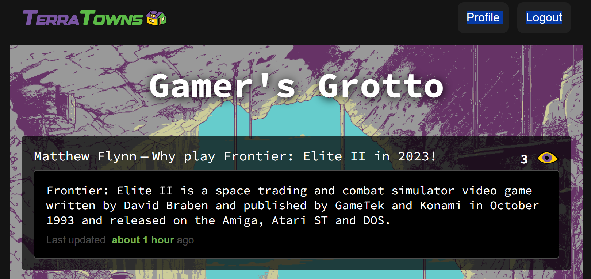
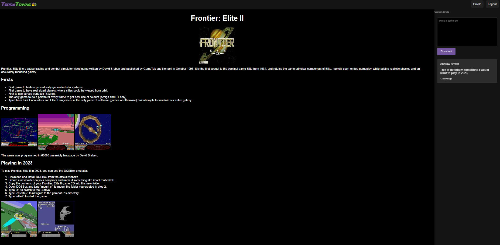
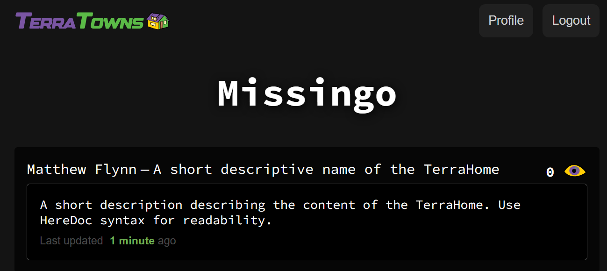
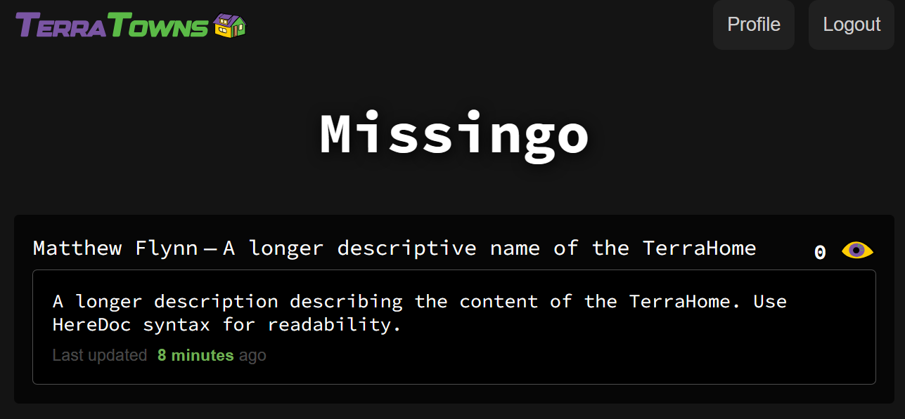

# <p align=center>Terraform Beginner Bootcamp 2023 Azure Week 2

## Week 2 Objectives.
The objectives of week 2 where:
- Clone a [Sinatra](https://en.wikipedia.org/wiki/Sinatra_%28software%29) web server for use as a mock TerraTowns server.
- Understand how the Sinatra mock server is coded using the Ruby programming language.
- Understand how gemfiles are used with Ruby applications.
- Understand how to execute a Ruby application.
- Understand CRUD and how it is related to Terraform custom providers.
- Clone bash scripts used for CRUD.
- Clone a Terraform custom provider into our repository.
- Understand how custom providers are coded using the Go programming language.
- Test the custom provider locally using the Sinatra web server.
- Test the custom provider locally using the CRUD bash scripts.
- Use the custom provider to create a `TerraHome' in [TerraTowns](https://terratowns.cloud/).
- Refactor project to better support creation of multiple 'Homes'.


# Table of Contents
- [Introduction to TerraTowns](#introduction-to-terratowns)
- [Sinatra server](#sinatra-server)
  - [Running the mock server](#running-the-mock-server)
  - [Gitpod environment updates](#gitpod-environment-updates)
- [Using the mock server](#using-the-mock-server)
  - [Bash 'create' script](#bash-create-script)
  - [Bash 'read' script](#bash-read-script)
  - [Bash 'update' script](#bash-update-script)
  - [Bash 'delete' script](#bash-delete-script)
- [Terraform providers](#terraform-providers)
- [TerraTowns custom provider](#terratowns-custom-provider)
  - [Custom provider configuration](#custom-provider-configuration)
  - [Custom provider build](#custom-provider-build)
  - [Using the custom provider](#using-the-custom-provider)
- [Testing the Terraform configuration with the mock server](#testing-the-terraform-configuration-with-the-mock-server)
  - [Testing TerraHome creation](#testing-terrahome-creation)
  - [Testing TerraHome update](#testing-terraHome-update)
  - [Testing TerraHome delete](#testing-terraHome-delete)
  - [Testing the Terraform configuration with the TerraTowns production server](#testing-the-terraform-configuration-with-the-terratowns-production-server)
- [Testing TerraHome creation on production server](#testing-terrahome-creation-on-production-server)
  - [Testing TerraHome update on production server](#testing-terrahome-update-on-production-server)
  - [Testing TerraHome delete on production server](#testing-terrahome-delete-on-production-server)
- [Refactoring Terraform configuration for multiple TerraHomes](#refactoring-terraform-configuration-for-multiple-terrahomes)
- [External References](#external-references)

## Introduction to TerraTowns
[TerraTowns](https://terratowns.cloud/) is a community website where bootcamp participants (terraformers) launch their own `TerraHome` (a user-created website) and connect their home to a `TerraTown` for other Terraformers to view. This is similar to GeoCities circa 2001.

There are five production `TerraTowns` and one testing `TerraTown` to choose based on the topic that best suits the static websites content.

#### TerraTowns home page listing all the TerraTowns
<p align="center">
  
</p>

### TerraHome

The picture below represents my `TerraHome` link named 'Why play Frontier: Elite II in 2023!' listed in the `Gamer's Grotto` TerraTown. Clicking on link takes you to the content distribution networks (CDN) domain name provisioned in the cloud provider.

#### Static website link in Town Gamer's Grotto
<p align="center">
  
</p>

If the cloud resources has been provisioned then displayed in a iframe will be the contents of the state website as shown below.

#### Static website displayed in iFrame
<p align="center">
  
</p>

## Sinatra server
[Sinatra](https://sinatrarb.com/documentation.html) is a free and open source micro server framework written in Ruby.

I have been provided with the Ruby code for this server. It will act as a mock `TerraTowns` server and will be used for testing with our Terraform custom provider named 'terratowns'.

I cloned the [code](https://github.com/ExamProCo/terratowns_mock_server) into this repository along with the Bash scripts for [Create Read Update Delete](https://en.wikipedia.org/wiki/Create,_read,_update_and_delete) (CRUD)

These bash scripts will be used to test all the endpoints of our mock server.

Create, Read, Update and Delete are the four actions required for all Terraform providers.

### Running the mock server
To run the mock server I use the following commands in the bash terminal window.

```bash
cd terratowns_mock_server
bundle install
```

Command, **bundle install**, installs the gems specified in the Gemfile. The Gemfile is a file that lists the Ruby gems that your application needs.

Once the gems have been installed, you can run your Ruby application using the **bundle exec** command. This will ensure that your application is running with the correct dependencies installed.

```bash
cd terratowns_mock_server
bundle exec ruby server.rb
```

This will start the web server on port 4567. You can then access the web application at http://localhost:4567.

bundle install is a very useful tool for managing Ruby dependencies. It ensures that your applications are always running with the correct dependencies installed.

Here are some additional benefits of using bundle install:

- It keeps your application's dependencies consistent across different machines.
- It makes it easy to update your application's dependencies.
- It helps to prevent dependency conflicts.


### Gitpod environment updates
I updated the gitpod.yml file to automatically start the server when a Gitpod workspace is launched.

#### .gitpod.yml


```yaml
## ...

  - name: sinatra
    before: |
      cd $GITPOD_REPO_ROOT
      cd terratowns_mock_server 
      bundle install
      bundle exec ruby server.rb

## ...
```

## Using the mock server

There are four bash scripts in the [bin/terratowns](../bin/terratowns/) folder. These scripts replicate how the Terraform Terratowns custom provider would interact with the Terratowns production server.

I used these scripts to test that the mock server is working as expected. The mock server is a very close match to the actual Terratowns production server.

Later on, I will test my Terraform custom provider against the mock server and then against the Terratowns production server.

To execute the scripts, I must first set the execution bit on all the files using the following command.

```bash
cd $GITPOD_REPO_ROOT
find bin/terratowns -type f -exec chmod u+x {} \
```
I check that the files are now executable using:

```bash
ls -l bin/terratowns
```

#### Expected console output
```bash
total 16
-rwxr-xr-x 1 gitpod gitpod 1048 Dec  5 11:47 create
-rwxr-xr-x 1 gitpod gitpod  790 Dec  5 11:47 delete
-rwxr-xr-x 1 gitpod gitpod  888 Dec  5 11:47 read
-rwxr-xr-x 1 gitpod gitpod 1102 Dec  5 11:47 update
```

### Bash 'create' script
This script is used to simulate creating the link to my Terrahome in a Terratown. Similar to that shown below.

#### Static website link in Town Gamer's Grotto
<p align="center">
  
</p>


The script has been hardcoded with some fake values.

```bash
user_uuid="e328f4ab-b99f-421c-84c9-4ccea042c7d1" # same as x_user_uuid
token="9b49b3fb-b8e9-483c-b703-97ba88eef8e0" # same as x_access_code
```
These values are taken from those hardcoded in the Ruby file [server.rb](../terratowns_mock_server/server.rb). 

#### server.rb
```ruby
  def x_access_code
    '9b49b3fb-b8e9-483c-b703-97ba88eef8e0'
  end

  def x_user_uuid
    'e328f4ab-b99f-421c-84c9-4ccea042c7d1'
  end
```

'x_access_code' is the the access code required to sign up and provides API access to TerraTowns production server.

'x_user_uuid' is the unique uuid every account holder at [exampro.co](https://app.exampro.co/student/auth/login) is given on sign up.

When using the Terratowns production server, these values are unique to me, and are considered sensitive. To obtain these sensitive variable values, I needed to login to my [exampro.co](https://app.exampro.co/student/auth/login) account and retrieve the user_uuid from my profile. I obtained the access code (token) from [my accounts vending machine](https://app.exampro.co/student/account/vending_machine). Once I obtained the access key, I used it to sign up to [Terratowns](https://terratowns.cloud/users/sign_up)

These sensitive variables are stored as Terraform variables in the development environment.

```bash
TF_VAR_teacherseat_user_uuid = "23bc8d00-9485-48de-8c59-faddeEXAMPLE" # x_user_uuid
TF_VAR_terratowns_access_token = "e11b2b1c-80db-4b79-bc3b-31e85EXAMPLE" # x_access_code
```

Other variables with fake hardcoded values include.

```bash
name="New House"
description="A new house description"
domain_name="3xf332sdfs.azurefd.net"
town="cooker-cove"
content_version=1
```

These values are not considered sensitive and will appear in the Terraform root module configuration file when using Terratowns custom provider.

The mock server validates these variables have values, then generates a unique uuid which is unique to each Terrahome on Terratowns.

At the time of writing, the Terratowns production server validates the domain_name to that ending with .cloudfront.net, which is specific to the AWS CloudFront CDN service. As this project uses Azure FrontDoor CDN the domain_name validation will fail. I have modified the mock server validation to allow the domain_name ending .azurefd.net.

#### server.rb domain_name validation
```ruby
  validates :domain_name, 
    format: { with: /\.azurefd\.net\z/, message: "domain must be from .azurefd.net" }
```

#### Running the script
```bash
./bin/terratowns/create
```

The script returns a random uuid, unique to each Terrahome in json format, as shown in the example below.

#### Output
```bash
{"uuid":"eb229a77-fee2-4213-ab74-9d890cc36124"}
```

### Bash 'read' script

The script 'read' returns in json format the payload of the Terrahome for the provided uuid.

#### Running the script
```bash
./bin/terratowns/read "eb229a77-fee2-4213-ab74-9d890cc36124"
```

#### Output
```json
{
  "uuid": "eb229a77-fee2-4213-ab74-9d890cc36124",
  "name": "New House",
  "town": "cooker-cove",
  "description": "A new house description",
  "domain_name": "3xf332sdfs.azurefd.net",
  "content_version": 1
}
```

### Bash 'update' script

This script is used to simulate updating the link to my Terrahome in a Terratown. 

The script has been hardcoded with some fake values. Similar to that provided by the 'create' script, but with a modified name and description. Note, we do not provide a domain_name, because the domain_name should only be given once, by 'create' script and should never change. Note the content_version needs to be incremented, else the update will not take place.

```bash
user_uuid="e328f4ab-b99f-421c-84c9-4ccea042c7d1" 
token="9b49b3fb-b8e9-483c-b703-97ba88eef8e0"
house_uuid="$1"
name="New House [Updated]"
description="A new house description. Its better than last time!"
content_version=2
```

#### Running the script

Because the mock server does not create any files for us to inspect, running this script alone will not be enough to determine if the mock server is working correctly. For this I will use [pry](https://pry.github.io/index.html) a powerful alternative to the standard Ruby interactive shell. Pry has been included in my Gemfile, and a require statement "require 'pry'" exists in the server.rb file.

To use Pry, I add the 'binding.pry' statement where I wish the mock server program execution to pause. 

#### Updated server.rb with binding.pry statement

```ruby

  # UPDATE
  put '/api/u/:user_uuid/homes/:uuid' do
    ensure_correct_headings
    find_user_by_bearer_token
    puts "# update - PUT /api/homes/:uuid"
    begin
      # Parse JSON payload from the request body
      payload = JSON.parse(request.body.read)
    rescue JSON::ParserError
      halt 422, "Malformed JSON"
    end

    # Validate payload data
    name = payload["name"]
    description = payload["description"]
    content_version = payload["content_version"]

    unless params[:uuid] == $home[:uuid]
      error 404, "failed to find home with provided uuid and bearer token"
    end

    home = Home.new
    home.town = $home[:town]
    home.domain_name = $home[:domain_name]
    home.name = name
    home.description = description
    home.content_version = content_version

    # pause execution here
    binding.pry

    unless home.valid?
      error 422, home.errors.messages.to_json
    end

    return { uuid: params[:uuid] }.to_json
  end

```

After adding the binding.pry statement the mock server must be stopped and restarted. Switch to the 'sinatra: localhost:4567' terminal and press control + c keys a few times until the server exits.

Restart the server.

```bash
bundle exec ruby server.rb
```

Open a new bash terminal tab and repeat running the create script, then run the update script.

```bash
./bin/terratowns/create
{"uuid":"bb505bb5-0e26-4521-8ca5-3e041451fc08"}

./bin/terratowns/update "bb505bb5-0e26-4521-8ca5-3e041451fc08"
```

The script will appear to pause. Now switch to the 'sinatra: localhost:4567' terminal. It should look similar the that shown below.

```bash

# update - PUT /api/homes/:uuid

From: /workspace/terraform-beginner-bootcamp-2023-azure/terratowns_mock_server/server.rb:172 self.PUT /api/u/:user_uuid/homes/:uuid:

    167:     home.name = name
    168:     home.description = description
    169:     home.content_version = content_version
    170: 
    171:     # pause execution here
 => 172:     binding.pry
    173: 
    174:     unless home.valid?
    175:       error 422, home.errors.messages.to_json
    176:     end
    177: 

[1] pry(#<TerraTownsMockServer>)> 

```

At the pry prompt, type 'home'. Displayed is the updates to the Terrahome 'name' and 'description' as defined in the 'update' script.

```bash

[3] pry(#<TerraTownsMockServer>)> home
=> #<Home:0x00007fb5c63863b8
 @content_version=2,
 @description="A new house description. Its better than last time!",
 @domain_name="3xf332sdfs.azurefd.net",
 @name="New House [Updated]",
 @town="cooker-cove">
[4] pry(#<TerraTownsMockServer>)> 

```

I can now inspect variables such as 'domain_name', by typing 'home.domain.name' 

```bash

[4] pry(#<TerraTownsMockServer>)> home.domain_name
=> "3xf332sdfs.azurefd.net"
```

I can view the 'payload' that was updated by typing, 'payload'

```bash
[5] pry(#<TerraTownsMockServer>)> payload
=> {"name"=>"New House [Updated]",
 "description"=>"A new house description. Its better than last time!",
 "content_version"=>2}
```
View the original Terrahome details by typing, '$home' 

```bash
[6] pry(#<TerraTownsMockServer>)> $home
=> {:uuid=>"274c6bf5-6679-4b78-8afb-70688a077bbc",
 :name=>"New House",
 :town=>"cooker-cove",
 :description=>"A new house description",
 :domain_name=>"3xf332sdfs.azurefd.net",
 :content_version=>1}
```

To exit the debugger, I type 'exit'.

```bash
[7] pry(#<TerraTownsMockServer>)> exit
```

Press control + c keys a few times until the server exits.

Restart the server.

```bash
bundle exec ruby server.rb
```

### Bash delete script

This script is used to simulate the deletion of a Terrahome from a Terratown. 

#### Running the script

```bash
./bin/terratowns/delete "eb229a77-fee2-4213-ab74-9d890cc36124"
```

The script returns the deleted uuid in json format, as shown below.

#### Output
```bash
{
    "uuid":"eb229a77-fee2-4213-ab74-9d890cc361"
}
```

I have now completed the testing of the Ruby mock server.

## Terraform providers

Terraform providers are plugins that allow Terraform to interact with various services and resources. Providers can be developed in any language, but [Go](https://go.dev/) is a popular choice because it offers several benefits such as **performance**, **concurrency**, and **ease 
of use**. [<sup>[2]</sup>](#external-references)

The `terraform-plugin-go` library is a low-level Go binding for the Terraform protocol that allows integrations to be built on top of it. It provides a minimal possible abstraction on top of the protocol, only hiding the implementation details of the protocol while leaving its semantics unchanged. [<sup>[3]</sup>](#external-references)

To develop a Terraform provider using Go, you can use the `terraform-plugin-sdk` library, which provides a set of helper functions and tools to simplify the development process. The `terraform-plugin-sdk` library includes a set of interfaces that define the methods that a provider must implement to interact with Terraform. These interfaces include the `ResourceProvider` interface, which defines the methods that a provider must implement to manage resources, and the `DataSourceProvider` interface, which defines the methods that a provider must implement to retrieve data. [<sup>[4]</sup>](#external-references)


## TerraTowns custom provider

I was provided with the TerraTowns custom provider source files. The custom provider was written in a single [main.go](../terraform-provider-terratowns/main.go) file. A second file `go.mod` was also provided. This file defines the module’s properties, such as its module path, the minimum version of Go required, and the list of other modules that it depends on. It also allows the replacement or exclusion of specific versions of required modules. It should be checked into the version control system. For more details, see [go.mod file reference](https://go.dev/doc/modules/gomod-ref). 

I cloned these files into the `terraform-provider-terratowns` folder of the projects repository.

Upon running the `go build` command, the file `go.sum` is created. This file contains the checksums of the direct and indirect dependencies of the module. It is used to verify that the dependencies have not been modified. The file is generated and updated by Go commands. It should also be checked into the version control system. For more information, see [Understanding go.sum and go.mod file in Go (Golang)](https://golangbyexample.com/go-mod-sum-module/).

### Custom provider configuration

As I am storing the custom TerraTowns provider with the project files, I must create a configuration file .terraformrc which is to be stored in the gitpod users home directory `/home/gitpod`.  

#### terraformrc

```sh
provider_installation {
  filesystem_mirror {
    path = "/home/gitpod/.terraform.d/plugins"
    include = ["local.providers/*/*"]
  } 
  direct {
   exclude = ["local.providers/*/*"] 
  }
}
```

The `.terraformrc` file is a CLI configuration file that configures per-user settings for CLI behaviors, which apply across all Terraform working directories. The `provider_installation` block in the `.terraformrc` file allows overriding Terraform's default installation behaviors, so I can force Terraform to use a local mirror for the TerraTowns custom provider instead [Terraform Registry](https://registry.terraform.io/). [<sup>[2]</sup>](#external-references)

The `provider_installation` block has two sub-blocks: `filesystem_mirror` and `direct`. The `filesystem_mirror` sub-block specifies a local filesystem mirror for provider plugins. The `path` attribute specifies the path to the directory where the plugins are stored, and the `include` attribute specifies the pattern of the plugin files to include. The `direct` sub-block specifies a direct installation method for provider plugins. The `exclude` attribute specifies the pattern of the provider plugins to exclude from direct installation. [<sup>[5]</sup>](#external-references)

In the `.terraformrc` file, the `filesystem_mirror` sub-block specifies that the local filesystem mirror for the provider plugin located at `/home/gitpod/.terraform.d/plugins`, and it includes all the plugins that match the pattern `local.providers/*/*`. The `direct` sub-block specifies that all the provider plugins that match the pattern `local.providers/*/*` should be excluded from direct installation. [<sup>[6]</sup>](#external-references)


### Custom provider build

To automate the build of the TerraTowns custom provider, I use bash script [bin\build_provider](../bin/build_provider). 

The script works as follows:

- It sets the PLUGIN_DIR variable to the location where the Terraform provider will be installed.
- It sets the PLUGIN_NAME variable to the name of the Terraform provider.
- It changes folder to the terraform-provider-terratowns folder.
- It copies the terraformrc file from the project root folder to the Gitpod home folder '/home/gitpod/'. as `.terraformrc`
- It removes the Terraform plugin folder, the Terraform state folder, and the Terraform lock file. This ensures that the new Terraform provider will be used.
- It builds the Terraform provider using the go build command.
- It creates the plugin folder if it does not already exist.
- It copies the Terraform provider to the plugin folder for both x86_64 and linux_amd64 architectures.

As I'm using the Gitpod development environment I need to run the script every time a new workspace is started. To do this I update the .gitpod.yml file accordingly by adding **source ./bin/build_provider** to the terraform-cli task as shown below.

```yaml
tasks:
  - name: terraform-cli
    env:
      TF_LOG: DEBUG
    before: |
      cd $PROJECT_ROOT
      cp $PROJECT_ROOT/terraform.tfvars.example $PROJECT_ROOT/terraform.tfvars
      source ./bin/create_bash_aliases
      source ./bin/install_terraform_cli
      source ./bin/generate_tfrc_credentials
      source ./bin/build_provider
      gp sync-done terraform-cli
```

Once the script has finished running, the Terraform provider is installed and ready to use. 

### Using the custom provider

Each Terraform module must declare which providers it requires, so that Terraform can install and use them. Provider requirements are declared in a required_providers block. [<sup>[7]</sup>](#external-references)

A provider requirement consists of a local name, a source location, and a version constraint.

To use the TerraTowns custom provider, I add the following to the root module main.tf files `required_providers` block.

#### Root module main.tf

```tf
terraform {
  required_providers {
    terratowns = {
      source = "local.providers/local/terratowns"
      version = "1.0.0"
    }
  }
}
```

The required_providers block must be nested inside the top-level terraform block (which can also contain other settings).

Each argument in the required_providers block enables one provider. The key determines the provider's local name (its unique identifier within this module), and the value is an object with the following elements:

- `source` - the global source address for the provider you intend to use, such as hashicorp/aws.

- `version` - a version constraint specifying which subset of available provider versions the module is compatible with.


**Provider Configuration**

Additionally, some providers require configuration (like endpoint URLs or cloud regions) before they can be used.

Provider configurations belong in the root module of a Terraform configuration. (Child modules receive their provider configurations from the root module. [<sup>[8]</sup>](#external-references)

A provider configuration is created using a provider block:

```tf
provider "terratowns" {
  # Configuration options
  endpoint = var.terratowns_endpoint
  user_uuid = var.teacherseat_user_uuid
  token = var.terratowns_access_token
}
```

The name given in the block header ("terratowns") is the local name of the provider to configure. This provider should already be included in a required_providers block.

The body of the block (between { and }) contains configuration arguments for the provider. Most arguments in this section are defined by the provider itself.

**Argument Reference**

The following arguments are supported:

- `endpoint` - (Required) The endpoint of the TerraTowns production server or the endpoint of the Mock server. This can also be sourced from the `TF_VAR_terratowns_endpoint` environment Variable.
<br>
- `user_uuid` - (Required, Sensitive) My user uuid, obtained by logging in to my [exampro.co](https://app.exampro.co/student/auth/login) account and retrieve the user_uuid from my profile. This should sourced from the `TF_VAR_terratowns_endpoint` environment Variable.
<br>
- `token` - (Required, Sensitive) My access code (token) from [exampro.co account vending machine](https://app.exampro.co/student/account/vending_machine). Needed to authenticate with the TerraTowns production server. This should be sourced from the `TF_VAR_terratowns_access_token` environment Variable.
<br>


The following resource is available with the TerraTowns custom provider.

**terratowns_home**

This resource manages a TerraHome.

**Argument Reference**

The following arguments are supported:

- `name` - (Required) The name of the `TerraHome` to be created in a `TerraTown`. Changing this and incrementing `content_version` forces an update of the resource.
<br>
- `description` - (Required) The description of the `TerraHome` which will be presented to all users who access the `TerraTown`. Changing this and incrementing `content_version` forces an update of the resource.
<br>
- `domain_name` - (Required) The domain name of the CDN distributing the static website. Changing this and incrementing `content_version` forces an update of the resource.
<br>
- `town` - (Required) The name of the TerraTown, required to locate the `TerraHome`. Use `missingo` for testing. Changing this and incrementing `content_version` forces an update of the resource.
<br>
- `content_version` - (Required) The version of the TerraHome. Changing this forces an update of the resource.


**Example Usage**

#### Root module main.tf

```tf
resource "terratowns_home" "home" {
  name = "A short descriptive name of the TerraHome"
  description = <<DESCRIPTION

A short description describing the content of the TerraHome. Use HereDoc syntax for readability.

DESCRIPTION
  domain_name = "dsdsf3453.azurefd.net"
  town = "missingo"
  content_version = 1
}
```

## Testing the Terraform configuration with the mock server

To test the TerraTowns custom provider against the mock server, I set the following environmental variables to match the hard coded values in the mock server source code file [server.rb](../terratowns_mock_server/server.rb).

```bash
TF_VAR_terratowns_endpoint = "http://localhost:4567/api"
TF_VAR_teacherseat_user_uuid = "e328f4ab-b99f-421c-84c9-4ccea042c7d1"
TF_VAR_terratowns_access_token = "9b49b3fb-b8e9-483c-b703-97ba88eef8e0"
```

I then add the required providers block, the provider configuration options block and then the terratowns_home resource block to the root module main.tf file.

#### Root module main.tf

```tf
terraform {
  required_providers {
    terratowns = {
      source = "local.providers/local/terratowns"
      version = "1.0.0"
    }
  }
}

provider "terratowns" {
  endpoint = var.terratowns_endpoint
  user_uuid = var.teacherseat_user_uuid
  token = var.terratowns_access_token
}

resource "terratowns_home" "home" {
  name = "A short descriptive name of the TerraHome"
  description = <<DESCRIPTION
A short description describing the content of the TerraHome. Use HereDoc syntax for readability.
DESCRIPTION
  domain_name = "dsdsf3453.azurefd.net"
  town = "missingo"
  content_version = 1
}
```

Switch to the `terraform-cli: bash terminal`. Initialise Terraform.

```bash
$ terraform init
```

#### Extracts from `terraform init` output.

```bash

## ...

Initializing the backend...
2023-12-07T11:32:52.903Z [DEBUG] New state was assigned lineage "e4b869ee-08e9-544b-b463-7e6a3366601e"
2023-12-07T11:32:52.903Z [DEBUG] checking for provisioner in "."
2023-12-07T11:32:52.907Z [DEBUG] checking for provisioner in "/usr/bin"
2023-12-07T11:32:52.907Z [DEBUG] checking for provisioner in "/home/gitpod/.terraform.d/plugins"

Initializing provider plugins...
- Finding local.providers/local/terratowns versions matching "1.0.0"...
- Installing local.providers/local/terratowns v1.0.0...
- Installed local.providers/local/terratowns v1.0.0 (unauthenticated)

## ...

Terraform has been successfully initialized!

You may now begin working with Terraform. Try running "terraform plan" to see
any changes that are required for your infrastructure. All Terraform commands
should now work.

If you ever set or change modules or backend configuration for Terraform,
rerun this command to reinitialize your working directory. If you forget, other
commands will detect it and remind you to do so if necessary.

```

The custom provider is now available for use. 


### Testing TerraHome creation

```bash
$ terraform plan
```

#### Extracts from `terraform plan` output.

```bash

## ...

Terraform used the selected providers to generate the following execution plan. Resource actions are indicated
with the following symbols:
  + create

Terraform will perform the following actions:

  # terratowns_home.home will be created
  + resource "terratowns_home" "home" {
      + content_version = 1
      + description     = <<-EOT

            A short description describing the content of the TerraHome. Use HereDoc syntax for readability.

        EOT
      + domain_name     = "dsdsf3453.azurefd.net"
      + id              = (known after apply)
      + name            = "A short descriptive name of the TerraHome"
      + town            = "missingo"
    }

Plan: 1 to add, 0 to change, 0 to destroy.
```

Switch to the `sinatra: localhost:4567` terminal, the following should be displayed.

```bash
# read - GET /api/homes/:uuid
```

Switch to the `terraform-cli: bash terminal`. Run `terraform apply` to create the resource.

```bash
$ terraform apply -auto-approve
```

Switch to the `sinatra: localhost:4567` terminal, the following should be displayed.

```bash

# create - POST /api/homes
name A short descriptive name of the TerraHome
description 
A short description describing the content of the TerraHome. Use HereDoc syntax for readability.

domain_name dsdsf3453.azurefd.net
content_version 1
town missingo
uuid 536e10f0-fcd3-41a4-8ad4-1dafcaceef5f
town missingo
uuid 536e10f0-fcd3-41a4-8ad4-1dafcaceef5f
```
Switch to the `terraform-cli: bash terminal`. Run `terraform apply` to create the resource.

```bash
$ terraform apply -auto-approve
```

#### Extracts from `terraform apply` output.

```bash
## ...

Apply complete! Resources: 1 added, 0 changed, 0 destroyed.
```

Check the local `terraform.tfstate` file for the new resource.

#### terraform.tfstate

```json
{
  "version": 4,
  "terraform_version": "1.6.5",
  "serial": 3,
  "lineage": "24ad7641-fb6f-8579-a770-6fa8e0d93750",
  "outputs": {},
  "resources": [
    {
      "mode": "managed",
      "type": "terratowns_home",
      "name": "home",
      "provider": "provider[\"local.providers/local/terratowns\"]",
      "instances": [
        {
          "schema_version": 0,
          "attributes": {
            "content_version": 1,
            "description": "A short description describing the content of the TerraHome. Use HereDoc syntax for readability.\n",
            "domain_name": "dsdsf3453.azurefd.net",
            "id": "523f4d4e-0db8-4589-8881-bd71f538080b",
            "name": "A short descriptive name of the TerraHome",
            "town": "missingo"
          },
          "sensitive_attributes": [],
          "private": "bnVsbA=="
        }
      ]
    }
  ],
  "check_results": null
}

```

### Testing TerraHome update

Make two changes to the resource `name` and `description` arguments.

#### main.tf

```tf
## ...

resource "terratowns_home" "home" {
  name = "A longer descriptive name of the TerraHome"
  description = <<DESCRIPTION
A longer description describing the content of the TerraHome. Use HereDoc syntax for readability.
DESCRIPTION
  domain_name = "dsdsf3453.azurefd.net"
  town = "gamers-grotto"
  content_version = 1
}
```

Switch to the `terraform-cli: bash terminal`. Run `terraform plan` to view the updates needed.

```bash
$ terraform plan
```

#### Extracts from `terraform plan` output.

```bash

## ...

Terraform used the selected providers to generate the following execution plan.
Resource actions are indicated with the following symbols:
  ~ update in-place

Terraform will perform the following actions:

  # terratowns_home.home will be updated in-place
  ~ resource "terratowns_home" "home" {
      ~ description     = <<-EOT
          - A short description describing the content of the TerraHome. Use HereDoc syntax for readability.
          + A longer description describing the content of the TerraHome. Use HereDoc syntax for readability.
        EOT
        id              = "38a1683e-eda0-4297-81e4-e3d110a01d08"
      ~ name            = "A short descriptive name of the TerraHome" -> "A longer descriptive name of the TerraHome"
        # (3 unchanged attributes hidden)
    }

Plan: 0 to add, 1 to change, 0 to destroy.

```

Run terraform apply, to apply the changes.

```bash
$ tf apply -auto-approve
```
Switch to the `sinatra: localhost:4567` terminal, the following should be displayed.

```bash
# read - GET /api/homes/:uuid
# update - PUT /api/homes/:uuid
```
Check the `terraform.tfstate` file for the resource updates.

#### terraform.tfstate

```json
{
  "version": 4,
  "terraform_version": "1.6.5",
  "serial": 3,
  "lineage": "6f674659-bc68-cd01-0f9d-5cc42175f680",
  "outputs": {},
  "resources": [
    {
      "mode": "managed",
      "type": "terratowns_home",
      "name": "home",
      "provider": "provider[\"local.providers/local/terratowns\"]",
      "instances": [
        {
          "schema_version": 0,
          "attributes": {
            "content_version": 1,
            "description": "\nA longer description describing the content of the TerraHome. Use HereDoc syntax for readability.\n\n",
            "domain_name": "dsdsf3453.azurefd.net",
            "id": "38a1683e-eda0-4297-81e4-e3d110a01d08",
            "name": "A longer descriptive name of the TerraHome",
            "town": "gamers-grotto"
          },
          "sensitive_attributes": [],
          "private": "bnVsbA=="
        }
      ]
    }
  ],
  "check_results": null
}
```

### Testing TerraHome delete

```bash
$ terraform destroy -auto-approve
```

Check the `terraform.tfstate` file for resource deletion.

#### terraform.tfstate

```json
{
  "version": 4,
  "terraform_version": "1.6.5",
  "serial": 9,
  "lineage": "6f674659-bc68-cd01-0f9d-5cc42175f680",
  "outputs": {},
  "resources": [],
  "check_results": null
}
```

I have now successfully tested the Terraform configuration and the TerraTowns custom provider against the mock terratowns server.

## Testing the Terraform configuration with the TerraTowns production server

To test the TerraTowns custom provider against the TerraTowns production server, I set the following environmental variables to match the actual values.

```bash
TF_VAR_terratowns_endpoint = "https://terratowns.cloud/api"
TF_VAR_teacherseat_user_uuid = "23bc8d00-9485-48de-8c59-faddeEXAMPLE"
TF_VAR_terratowns_access_token = "e11b2b1c-80db-4b79-bc3b-31e85EXAMPLE"
```

Reuse the existing root module `main.tf`

Switch to the `terraform-cli: bash terminal`. Initialise Terraform.

```bash
$ terraform init
```

#### Extracts from `terraform init` output.

```bash

## ...

Initializing the backend...
2023-12-07T11:32:52.903Z [DEBUG] New state was assigned lineage "e4b869ee-08e9-544b-b463-7e6a3366601e"
2023-12-07T11:32:52.903Z [DEBUG] checking for provisioner in "."
2023-12-07T11:32:52.907Z [DEBUG] checking for provisioner in "/usr/bin"
2023-12-07T11:32:52.907Z [DEBUG] checking for provisioner in "/home/gitpod/.terraform.d/plugins"

Initializing provider plugins...
- Finding local.providers/local/terratowns versions matching "1.0.0"...
- Installing local.providers/local/terratowns v1.0.0...
- Installed local.providers/local/terratowns v1.0.0 (unauthenticated)

## ...

Terraform has been successfully initialized!

You may now begin working with Terraform. Try running "terraform plan" to see
any changes that are required for your infrastructure. All Terraform commands
should now work.

If you ever set or change modules or backend configuration for Terraform,
rerun this command to reinitialize your working directory. If you forget, other
commands will detect it and remind you to do so if necessary.

```

The custom provider is now available for use. 


### Testing TerraHome creation on production server

```bash
$ terraform plan
```

#### Extracts from `terraform plan` output.

```bash

## ...

Terraform used the selected providers to generate the following execution plan. Resource actions are indicated
with the following symbols:
  + create

Terraform will perform the following actions:

  # terratowns_home.home will be created
  + resource "terratowns_home" "home" {
      + content_version = 1
      + description     = <<-EOT
            A short description describing the content of the TerraHome. Use HereDoc syntax for readability.
        EOT
      + domain_name     = "dsdsf3453.azurefd.net"
      + id              = (known after apply)
      + name            = "A short descriptive name of the TerraHome"
      + town            = "missingo"
    }

Plan: 1 to add, 0 to change, 0 to destroy.
```

Switch to the `terraform-cli: bash terminal`. Run `terraform apply` to create the resource.

```bash
$ terraform apply -auto-approve
```

#### Extracts from `terraform apply` output.

```bash

## ...

2023-12-07T13:27:06.910Z [ERROR] vertex "terratowns_home.home" error: failed to create home resource, status_code: 422, status: 422 Unprocessable Entity, body map[err:map[domain_name:[domain must be from .cloudfront.net]]]
╷
│ Error: failed to create home resource, status_code: 422, status: 422 Unprocessable Entity, body map[err:map[domain_name:[domain must be from .cloudfront.net]]]
│ 
│   with terratowns_home.home,
│   on main.tf line 32, in resource "terratowns_home" "home":
│   32: resource "terratowns_home" "home" {
│ 
╵

```

This error is due to the TerraTowns production server validator. The validator will allow only domain_name ending with `.cloudfront.net`.

To demonstrate that my configurations would work if the `domain_name` ended with `.cloudfront.net`. I updated my main.tf accordingly and continued testing.

Switch to the `terraform-cli: bash terminal`. Run `terraform apply` to create the resource.

```bash
$ terraform apply -auto-approve
```

#### Extracts from `terraform apply` output.

```bash
## ...

Apply complete! Resources: 1 added, 0 changed, 0 destroyed.
```

Check the local `terraform.tfstate` file for the new resource.

#### terraform.tfstate

```json
{
  "version": 4,
  "terraform_version": "1.6.5",
  "serial": 7,
  "lineage": "24ad7641-fb6f-8579-a770-6fa8e0d93750",
  "outputs": {},
  "resources": [
    {
      "mode": "managed",
      "type": "terratowns_home",
      "name": "home",
      "provider": "provider[\"local.providers/local/terratowns\"]",
      "instances": [
        {
          "schema_version": 0,
          "attributes": {
            "content_version": 1,
            "description": "A short description describing the content of the TerraHome. Use HereDoc syntax for readability.\n",
            "domain_name": "dsdsf3453.cloudfront.net",
            "id": "ed96476d-7bb5-4361-9715-2e942d1b1034",
            "name": "A short descriptive name of the TerraHome",
            "town": "missingo"
          },
          "sensitive_attributes": [],
          "private": "bnVsbA=="
        }
      ]
    }
  ],
  "check_results": null
}

```

Check that the TerraHome is now visible on the [TerraTowns website](https://terratowns.cloud/t/missingo). See image below.

#### Static website link in Missingo
<p align="center">
  
</p>

### Testing TerraHome update on production server

Make two changes to the resource `name` and `description` arguments.

#### main.tf

```tf
## ...

resource "terratowns_home" "home" {
  name = "A longer descriptive name of the TerraHome"
  description = <<DESCRIPTION
A longer description describing the content of the TerraHome. Use HereDoc syntax for readability.
DESCRIPTION
  domain_name = "dsdsf3453.cloudfront.net"
  town = "missingo"
  content_version = 2
}
```

Switch to the `terraform-cli: bash terminal`. Run `terraform plan` to view the updates needed.

```bash
$ terraform plan
```

#### Extracts from `terraform plan` output.

```bash

## ...

Terraform used the selected providers to generate the following execution plan.
Resource actions are indicated with the following symbols:
  ~ update in-place

Terraform will perform the following actions:

  # terratowns_home.home will be updated in-place
  ~ resource "terratowns_home" "home" {
      ~ content_version = 1 -> 2
      ~ description     = <<-EOT
          - A short description describing the content of the TerraHome. Use HereDoc syntax for readability.
          + A longer description describing the content of the TerraHome. Use HereDoc syntax for readability.
        EOT
        id              = "ed96476d-7bb5-4361-9715-2e942d1b1034"
      ~ name            = "A short descriptive name of the TerraHome" -> "A longer descriptive name of the TerraHome"
        # (2 unchanged attributes hidden)
    

Plan: 0 to add, 1 to change, 0 to destroy.

## ...

```

Run terraform apply, to apply the changes.

```bash
$ tf apply -auto-approve
```

Check the `terraform.tfstate` file for the resource updates.

#### terraform.tfstate

```json
{
  "version": 4,
  "terraform_version": "1.6.5",
  "serial": 11,
  "lineage": "24ad7641-fb6f-8579-a770-6fa8e0d93750",
  "outputs": {},
  "resources": [
    {
      "mode": "managed",
      "type": "terratowns_home",
      "name": "home",
      "provider": "provider[\"local.providers/local/terratowns\"]",
      "instances": [
        {
          "schema_version": 0,
          "attributes": {
            "content_version": 2,
            "description": "A longer description describing the content of the TerraHome. Use HereDoc syntax for readability.\n",
            "domain_name": "dsdsf3453.cloudfront.net",
            "id": "ed96476d-7bb5-4361-9715-2e942d1b1034",
            "name": "A longer descriptive name of the TerraHome",
            "town": "missingo"
          },
          "sensitive_attributes": [],
          "private": "bnVsbA=="
        }
      ]
    }
  ],
  "check_results": null
}

```

Check that the TerraHome has updated on the [TerraTowns website](https://terratowns.cloud/t/missingo). See image below.

#### Static website link in Missingo
<p align="center">
  
</p>

### Testing TerraHome delete on production server

```bash
$ terraform destroy -auto-approve
```

Check the `terraform.tfstate` file for resource deletion.

#### terraform.tfstate

```json
{
  "version": 4,
  "terraform_version": "1.6.5",
  "serial": 13,
  "lineage": "24ad7641-fb6f-8579-a770-6fa8e0d93750",
  "outputs": {},
  "resources": [],
  "check_results": null
}
```

Check that the TerraHome has been deleted from the [TerraTowns website](https://terratowns.cloud/t/missingo).


I have now successfully tested the Terraform configuration and custom TerraTowns provider with the TerraTowns production server. I have viewed my TerraHome on the TerraTowns `Missingo` webpage.

## Refactoring Terraform configuration for multiple TerraHomes

Registered users of TerraTowns can create up to 12 TerraHomes across the five production TerraTowns. For every TerraHome, I would need to provision multiple static website/cdn for each. I can do this by creating multiple instances of the `terrahome_azure` module. For each module a new resource of `terratowns_home` is needed.

## External References
- [Writing Custom Terraform Providers](https://www.hashicorp.com/blog/writing-custom-terraform-providers) <sup>[1]</sup>
- [terraform-plugin-go](https://github.com/hashicorp/terraform-plugin-go) <sup>[2]</sup>
- [Browse Providers Registry](https://registry.terraform.io/browse/providers) <sup>[3]</sup>
- [Creating a Terraform Provider for Just About Anything](https://www.hashicorp.com/resources/creating-terraform-provider-for-anything) <sup>[4]</sup>
- [go.mod file reference](https://go.dev/doc/modules/gomod-ref) <sup>[5]</sup>
- [CLI Configuration File (.terraformrc or terraform.rc)](https://developer.hashicorp.com/terraform/cli/config/config-file) <sup>[5]</sup>
- [Terraform Local Providers and Registry Mirror Configuration](https://servian.dev/terraform-local-providers-and-registry-mirror-configuration-b963117dfffa) <sup>[6]</sup>
- [Provider Requirements](https://developer.hashicorp.com/terraform/language/providers/requirements) <sup>[7]</sup>
- [Provider Configuration](https://developer.hashicorp.com/terraform/language/providers/configuration) <sup>[8]</sup>